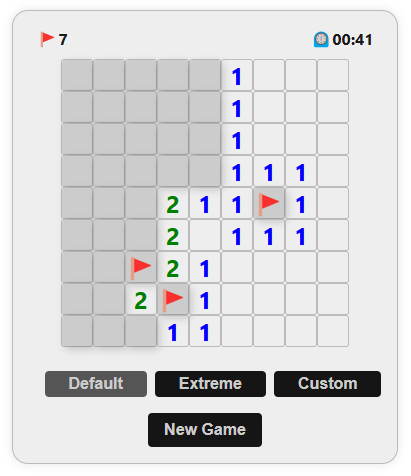
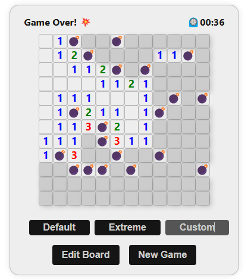

# **Minesweep Plus**: a minesweeper mini-game 💣

## Technologies Used
[](https://skillicons.dev)

## Deployment

First, clone or download the repository from GitHub.

1. Install dependencies
```
npm install
```

2. Run the program
```
npm run dev
```

## Project Overview
### Features
- First click safety
- Game win/over logic
- Flags logic
- Timer
- Level selection & customization

### Board Customization
To customize your own board, follow these steps:

1. Click on "Custom" in level selection tab.
2. Select "Edit Board".
3. Modify your custom settings.




